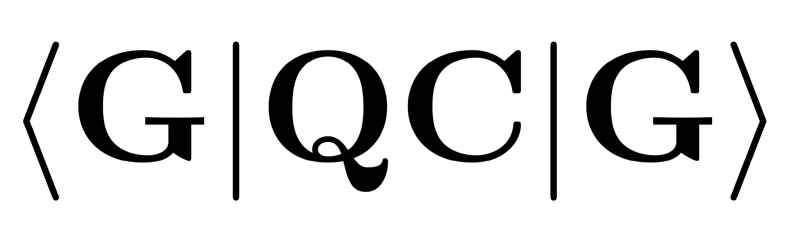

> This project has a [Code of Conduct](https://github.com/GQCG-edu/report-template/blob/develop/CODE_OF_CONDUCT.md).
> By interacting with this repository, organisation, or community you agree to
> abide by its terms.

# Style guide

* Use the [LaTeX physics package](http://mirrors.ibiblio.org/CTAN/macros/latex/contrib/physics/physics.pdf).
* Do not use floats for figures (see \begin{center}). Use captionof to provide a caption.
* Add important terms to the index with `\index{index}`.
